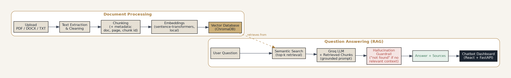

# Harborview — Document RAG Chatbot Dashboard
**DevSynt AI Internship — Task 5: AI-Powered Document RAG Chatbot Dashboard**

A full-stack Retrieval-Augmented Generation (RAG) application: upload documents, ask questions in natural language, and get answers grounded strictly in what those documents actually say — with sources cited, and a built-in refusal when the answer isn't there.

## Overview

Users upload PDF/DOCX/TXT documents through a React dashboard. The backend extracts and chunks the text, embeds it locally, and stores it in a vector database. When a user asks a question in the chat interface, the system retrieves the most relevant chunks, sends them to an LLM as grounding context, and returns an answer with the exact document + page it came from. If the knowledge base doesn't contain the answer, the chatbot says so explicitly rather than guessing.

The test knowledge base used throughout development is a fictional real-estate company, **Harborview Realty Group**, represented by 5 internally-consistent PDFs (Company Overview, Property Listings, Services & Fees, FAQs, Policies & Terms).

## Features

- **Dashboard** — live counts of total/processed/processing/failed documents, indexed chunks, and questions asked (all sourced from the backend, nothing hardcoded)
- **Document management** — drag-and-drop upload, live processing status, delete, re-process
- **Chatbot** — multi-session chat history, timestamps, loading/error states, and a source citation shown under every answer
- **Hallucination guardrail** — if no relevant chunks are retrieved, the system returns "I could not find this information in the uploaded documents" *before* ever calling the LLM

## Tech Stack

| Layer | Technology | Why |
|---|---|---|
| Frontend | React (Vite) | Fast build, deploys free on Vercel |
| Backend | FastAPI | Recommended in the brief; clean async API |
| Vector DB | ChromaDB | Fully local, free, no server setup |
| Embeddings | sentence-transformers (`all-MiniLM-L6-v2`) | Local, free, zero API cost or rate limits |
| LLM | Groq (`openai/gpt-oss-120b`) | Free tier, fast inference, cloud-based (no local hardware burden) |
| Metadata / chat history | SQLite | Lightweight, zero setup, tracks document status and chat sessions |

## RAG Architecture



**Document side:** Upload → Text Extraction → Chunking (with document ID, document name, page number, chunk ID metadata) → Local Embeddings → ChromaDB storage.

**Question side:** User question → Semantic search (top-k retrieval, k=6) → Retrieved chunks + question sent to Groq as a grounded prompt → Hallucination guardrail (explicit refusal if nothing relevant was retrieved) → Answer + deduplicated source citations → displayed in the chat dashboard.

## Project Structure

```
devsynt-task5/
├── backend/
│   ├── app/
│   │   ├── main.py              # FastAPI app + all endpoints
│   │   ├── config.py            # env-var driven configuration
│   │   ├── text_extraction.py   # PDF/DOCX/TXT extraction
│   │   ├── chunking.py          # chunking + metadata tagging
│   │   ├── vector_store.py      # embeddings + ChromaDB
│   │   ├── rag.py               # retrieval + Groq + guardrail
│   │   ├── processing.py        # document pipeline orchestration
│   │   └── database.py          # SQLite: document/session/message registry
│   ├── requirements.txt
│   └── .env.example
├── frontend/
│   ├── src/
│   │   ├── App.jsx
│   │   ├── api.js
│   │   └── components/ (Dashboard, Documents, Chat)
│   └── .env.example
├── data/documents/               # 5 test PDFs (Harborview Realty Group)
├── test_report/test_report.md    # 14-question test report
├── docs/architecture_diagram.png
└── README.md
```

## Setup & Installation

### Backend
```bash
cd backend
pip install -r requirements.txt
cp .env.example .env
# edit .env and add your GROQ_API_KEY
python -m uvicorn app.main:app --reload
```
Backend runs at `http://127.0.0.1:8000` (interactive API docs at `/docs`).

### Frontend
```bash
cd frontend
npm install
cp .env.example .env
npm run dev
```
Frontend runs at `http://localhost:5173`.

## Environment Variables

**Backend (`backend/.env`):**
| Variable | Description | Default |
|---|---|---|
| `GROQ_API_KEY` | Your Groq API key (required) | — |
| `MODEL_NAME` | Groq model used for answer generation | `openai/gpt-oss-120b` |
| `EMBEDDING_MODEL` | Local embedding model | `all-MiniLM-L6-v2` |
| `CHROMA_DB_PATH` | Vector DB storage path | `./chroma_store` |
| `UPLOAD_DIR` | Uploaded file storage path | `./uploaded_documents` |
| `CHUNK_SIZE` | Characters per chunk | `800` |
| `CHUNK_OVERLAP` | Overlap between chunks | `120` |
| `TOP_K_RESULTS` | Chunks retrieved per question | `6` |

**Frontend (`frontend/.env`):**
| Variable | Description |
|---|---|
| `VITE_API_URL` | Backend API base URL |

`.env` is git-ignored in both folders — only `.env.example` is committed. No secrets are hardcoded anywhere in the codebase.

## API Overview

| Endpoint | Method | Purpose |
|---|---|---|
| `/api/dashboard/stats` | GET | Live dashboard counts |
| `/api/documents/upload` | POST | Upload + background-process a document |
| `/api/documents` | GET | List all documents + status |
| `/api/documents/{id}` | GET / DELETE | Get or delete a document |
| `/api/documents/{id}/reprocess` | POST | Re-run the pipeline on a document |
| `/api/chat/sessions` | GET / POST | List or create chat sessions |
| `/api/chat/sessions/{id}/messages` | GET | Chat history for a session |
| `/api/chat/message` | POST | Ask a question, get a grounded answer + sources |

Full interactive documentation is auto-generated by FastAPI at `/docs`.

## Testing

10+ required test questions (14 total) were run covering direct-answer, cross-section, multi-document, no-answer-in-knowledge-base, and hallucination-bait categories. Full results: [`test_report/test_report.md`](test_report/test_report.md).

**Result: 14/14 correct**, including one real, documented retrieval-tuning fix made *during* testing (increasing `TOP_K_RESULTS` from 4 to 6 after a multi-document question initially missed the correct chunk) — included transparently rather than hidden, as evidence of genuine iterative testing.

## Limitations

- Embedding and retrieval are local/CPU-based; very large document sets would benefit from a GPU-backed or hosted vector DB for production scale.
- Retrieval quality depends on chunk size/overlap tuning — descriptive/superlative phrasing (e.g. "most expensive") required increasing `TOP_K_RESULTS` to reliably surface the right chunk (see Testing section).
- The LLM (Groq `openai/gpt-oss-120b`) is a general-purpose hosted model, not fine-tuned on this specific domain; grounding relies entirely on the retrieval + prompt guardrail, not model fine-tuning.
- ChromaDB storage in this setup is local disk — on the deployed (Render) version, storage may reset on redeploy/restart depending on the hosting tier.

## Deployment

- Frontend deployed on **Vercel** (free tier): [https://devsynt-task5-iqm1-three.vercel.app/]

## Demo Video

[https://drive.google.com/file/d/1-5YE773usVcmdOZze0VvaOOBPkQBNPxo/view?usp=sharing]

## LinkedIn Post

[https://www.linkedin.com/feed/update/urn:li:activity:7504271849833537538/]
